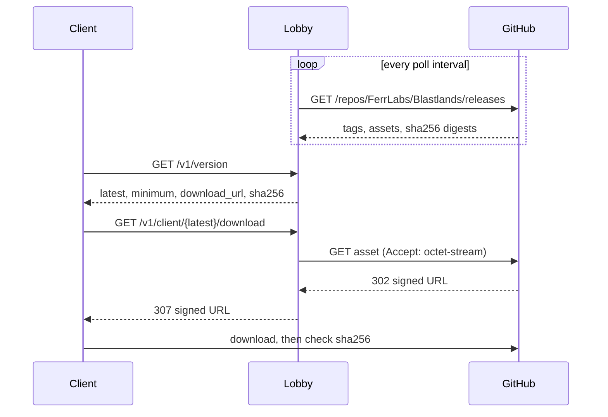
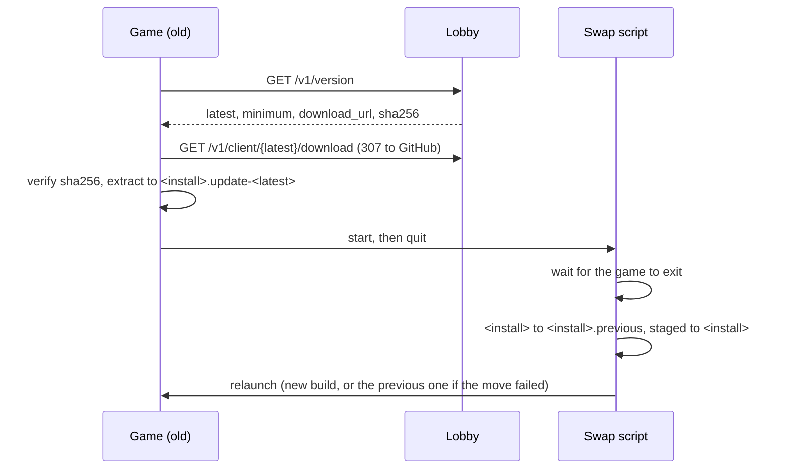

# Architecture

## Why dedicated servers

The alternative was host-client with relay (one player hosts, everyone else connects
through a relay). It was rejected:

- The host's upload bandwidth and CPU become everyone's ceiling. A bomber game is
  latency-sensitive — a bad host ruins the match for seven other people.
- The host is authoritative, so the host can trivially cheat.
- The host leaving kills the match, and host migration in a simulation-heavy game means
  re-syncing full state under time pressure.

We have a VPS, and a bomber match is cheap to simulate: an 8-player match on a 15×13 grid
at 30 Hz is a rounding error of CPU. Running the simulation server-side costs little and
removes all three problems.

## Components

### Lobby service (`server/`, Rust + axum)

Long-lived HTTP service. Owns the match directory: which matches exist, who is waiting,
and where a match's game server lives. It is deliberately dumb about gameplay — it never
sees a bomb.

Responsibilities:

- `GET /` — the download page: an Install button pointing at the installer when the release carries one,
  the zip otherwise, and a disabled one before any build exists. The HTML is embedded in the binary
  (`landing.html`).
- `GET /v1/client/{version}/installer` — redirect to the release's `Blastlands-Setup-<tag>.exe`, like
  `.../download` does for the zip. Only the published version has one, and only if the release carries it.
- `GET /v1/matches` — public list of matches accepting players.
- `POST /v1/matches` — create a match, allocate a game server instance, return its endpoint.
  The body may name a `mode`, `arena` (the default), `classic`, `classic_blinded` or `survival`. It is on
  every listing, in the create response, and in the instance's assignment, which the
  entrypoint passes to the binary as `--mode`. A client builds the same rules from the mode in
  its invite, since prediction runs them before the first snapshot lands. `bot_skill`
  (`easy`, `normal` by default, or `hard`) travels the same way, as `--bots`, and only the
  server reads it. `max_players` runs from 2 to 8, the most spawns a board generates.
- `POST /v1/matches/{id}/join` — reserve a slot, return the endpoint and a join ticket.
- `POST /v1/matches/{id}/bots` — host-only, claims an open seat for a bot instead of
  waiting for someone to join it. A game server instance already fills every seat nobody
  human took, so this only narrows who may still join and lets a solo host clear the
  `MIN_PLAYERS` floor without a second human.
- `GET /v1/matches/{id}` — one match and whether it has started, which is how a player
  who joined learns the host pressed start: a started match leaves the listing.
- Reap matches whose game server stopped heartbeating.

Every refusal, whatever the layer, answers `{"code": "...", "message": "..."}` as JSON. That
includes a request body axum itself refuses before a handler runs, such as an out-of-roster
`character` or a `name` outside `DisplayName`'s length and character set: a `ValidatedJson`
extractor stands in for `Json<T>` on every route that reads a body and turns axum's own
rejection into the same shape, at axum's own status (422 for a body that parses as JSON but not
into the request type, 400 for one that is not JSON at all). Without it, that one path breaks the
contract every other refusal keeps, and a client reading for a code and finding none has no way
to tell "you sent something wrong" apart from "I could not read that at all".

### Join tickets

The lobby signs a game ticket for every player it admits: the host gets one in
`game_ticket` when creating the match, a joining player gets one in `ticket`. The `ticket`
returned by create is something else, the host's key for `POST /v1/matches/{id}/start`.

A game ticket is six dot-separated fields, or seven when the player chose a character:

```
v1.<match id>.<player name, hex of its UTF-8>.<expiry, unix seconds>.<nonce>.<HMAC-SHA256, hex>
v2.<match id>.<player name, hex of its UTF-8>.<character>.<expiry, unix seconds>.<nonce>.<HMAC-SHA256, hex>
```

The HMAC covers every field before it and uses `BLASTLANDS_TICKET_SECRET` (at least 32
bytes), which the lobby and every game server instance share.

The character is optional in both `POST /v1/matches` and `POST /v1/matches/{id}/join`
(`"character": "demolisher" | "runner" | "grenadier" | "sapper"`). Without one the lobby
still signs a `v1` ticket, so a game server that only reads `v1` keeps admitting everybody
whichever image rolls out first. Being signed, the character cannot be swapped between the
lobby and the door. The instance hands it to the seat the connection takes, before the first
tick only and only in a mode with characters; a reconnect mid-match keeps the kit it had.

A ticket is issued when its holder joins but spent when the match starts, so its lifetime
is tied to the match rather than to the player: a match that has not started within
`BLASTLANDS_LOBBY_WAITING_TTL_SECONDS` (900 by default) is reaped whoever is in it, and a
ticket lives that long plus two minutes to connect. Any ticket for a match that can still
start is therefore still valid when it does.

Match state is in-memory for now. It is intentionally not in Postgres: a match's lifetime
is minutes, nothing about it is worth surviving a restart, and a restart during a match
only costs the lobby listing — running matches keep running because clients already hold
their server endpoint. If persistence is ever needed (stats, history), that is a separate
store, not this one.

### Game server (`client/`, Unity Dedicated Server build)

The same Unity project as the client, built for the Dedicated Server platform (headless
Linux, no rendering). One process per match, one container per process.

It runs the authoritative simulation and is the only thing allowed to decide that a player
died. Clients send inputs; the server sends state. Bots are just players whose inputs come
from `BotBrain` instead of a socket — the simulation cannot tell the difference, which is
what keeps them honest.

Building the server from the same project as the client is the point: gameplay code exists
once. A separate Rust game server was considered and rejected — it would mean writing every
bomb, blast and power-up rule twice, in two languages, and keeping them bit-identical
forever.

It starts itself. `ServerBootstrap` runs on load in a server build, so there is no scene to
wire and no inspector to fill in: everything it needs comes from `--port`, `--match`,
`--players` and `--lobby`, or from `BLASTLANDS_PORT` and friends when the host is configured
once and the arguments name the instance. All four are required, an argument beats the
environment, and a bad one refuses to start rather than guessing. A wrong port collides with
a neighbour, a wrong match id releases somebody else's match.

The guard is `UNITY_SERVER`, which Unity defines for the Dedicated Server subtarget itself,
rather than a hand-added `SERVER` define somebody has to keep in step with `build.yml`.
`LocalMatchDriver` switches itself off under it, and since the view, HUD, camera and fog are
only ever built when that driver binds them, the client scene sits inert and nothing renders.

Exit codes are what a supervisor reads: 0 for a match that resolved, 1 for options it would
not start on, 2 for a match that failed to start or ran out its clock without resolving.
Anything non-zero has to mean failure, or a crash loop reads as a clean shutdown and the
match is never released.

### Client (`client/`, Unity Standalone build)

Renders, reads input, predicts local movement, reconciles against server state.

Presentation reads the simulation, never the other way round. Character animation is the
case where that is easiest to get wrong, so it is worth stating: the animator is told what
the player did last tick, and is never allowed to move anyone. Root motion is off on every
character, and the in-place clips (`Walk_Static`, `Run_Static`) are the ones selected, so a
stride cannot displace a transform the simulation owns down to the sub-tile unit. A player
who animates their way off their own position is a player the server will disagree with.

The stride rate is a ratio of the ground the simulation actually moved someone over
against the speed the clip was authored at, which is why `MatchView.runClipSpeed` exists.
Swapping animation packs means measuring that number again rather than accepting whatever
skating falls out.

**Remote players are drawn a few ticks in the past.** Snapshots arrive at the tick rate with
jitter and loss, so drawing each one as it lands makes everybody else stutter. `PlayerTrail`
keeps the last second of snapshot positions and `InterpolationClock` runs a render time three
ticks behind the newest one; remote players are placed between the two snapshots around that
time. A lost snapshot is bridged by its neighbours, a jump of more than a tile per tick (a
wall regrowing on someone) is held and then snapped rather than slid across the board, and
the clock never runs past the newest snapshot, so it holds instead of guessing. It steers by
a tenth of its speed to stay on the delay and only jumps when it has fallen far behind.

Bombs and flames are not delayed. They come from the newest snapshot and are aged by the
server ticks the clock says have passed since it (`SnapshotAge`), never by local time: a fuse
keeps counting and a flame goes out on its server tick through a short loss burst, and a
flame is never shown later than the snapshot that carries it.

**The local player is predicted, not delayed.** `ClientPrediction` keeps a second
`MatchState` and runs `MatchSim.Tick` on the input the moment it is sent, so pressing right
moves the character on that frame instead of a round trip later. Every sent input is kept
until a snapshot acknowledges it. When one lands, the predicted state is overwritten with the
server's (through `SnapshotCodec`, the copy is free of anything the wire does not carry) and
the unacknowledged inputs are replayed on top. A tick whose input never reached the server is
replayed the way the server fills it, movement repeated without the buttons, so the client
does not invent a bomb the server never saw. Remote seats are replayed as standing still;
they are drawn from the trail, not from the predicted state, so that guess never shows.

The correction is smoothed rather than snapped. `CorrectionSmoother` keeps the difference the
replay produced as an offset on the drawn position and works it off by a quarter per tick, so
the character is still drawn where it was the frame before. A divergence of more than a tile
is snapped instead, because sliding a player a tile across a board where a tile is the
difference between alive and dead would be a lie. The camera follows the predicted state, or
it would trail the player by the latency it exists to hide.

This is only tractable because `Core/` is deterministic and engine-free: the replay is the
same code the server ran, on the same inputs, and must reach the same position.

## The simulation core

`client/Assets/_Game/Core/` is plain C# with **no `UnityEngine` dependency**. This is a hard
rule, enforced by the assembly definition and by the fact that `tests/` compiles the same
sources under plain .NET.

Two things fall out of it:

- CI runs the gameplay tests with `dotnet test`, in seconds, with no Unity licence and no
  10 GB editor image. Only builds and PlayMode tests need the licence.
- The simulation is deterministic and engine-independent, which is what makes
  client-side prediction and server reconciliation tractable: both sides run the same code
  on the same inputs and must agree.

Determinism rules for anything under `Core/`:

- Integer grid coordinates and fixed-point sub-tile positions. No `float`, no `Vector3`.
- No `System.Random` without an explicit seed carried in the match state.
- No wall-clock time, no `DateTime.Now`. Time is a tick counter.
- No iteration over unordered collections where order affects outcome.

## Match lifecycle

```
client                    lobby                     game server
  │                         │                            │
  ├─ POST /v1/matches ─────▶│                            │
  │                         ├─ allocate instance ───────▶│ (container starts)
  │                         │◀─ ready, host:port ────────┤
  │◀─ match + endpoint ─────┤                            │
  │                                                      │
  ├─ connect (UDP, join ticket) ────────────────────────▶│
  │◀════════ authoritative state, 30 Hz ════════════════▶│
  │                         │◀─ heartbeat / final score ─┤
  │                         │◀─ instance exits ──────────┤
```

Other clients see the match via `GET /v1/matches` between creation and start, and join the
same way.

The Match scene carries both drivers: `LocalMatchDriver` for a practice session against
bots on this machine alone, `NetworkedMatchDriver` for the match above. `MatchHandoff`
decides between them, a static the lobby screens leave an invite in on their way to
`SceneManager.LoadScene`. `LocalMatchDriver` stands itself down when one is waiting, so it
never builds its own arena and its own bots on top of the match the lobby just set up.
Opening the Match scene directly, with no invite left, is what runs a local practice
session or reproduces a bug from its seed.

The game server admits a connection only through Netcode's connection approval, with the
game ticket as connection data. `GameTicketVerifier` refuses a ticket that is malformed,
signed with another key, issued for another match, past its expiry, or already used by an
earlier connection. Expiry is the one place the game server reads the wall clock; it
decides who gets in, not what happens in the simulation. The instance refuses to start
without `BLASTLANDS_TICKET_SECRET`.

## Updating the client

There is no launcher, so nothing else can update the game. That makes the update path part
of the architecture rather than a packaging detail.

The failure it exists to prevent is not "the player misses a feature". It is an outdated
client joining a current match: the simulation is deterministic and lockstep-ish, so a client
running different rules **desyncs silently** rather than failing loudly. Everyone's match is
quietly wrong. Refusing that client up front is the whole point.

**The lobby is the gate.** `GET /v1/version` returns:

```json
{ "latest": "26.9.0", "minimum": "26.8.0",
  "download_url": "https://api.blastlands.ferrlabs.com/v1/client/26.9.0/download", "sha256": "…" }
```

**`latest` comes from GitHub, not from configuration.** Every `BLASTLANDS_RELEASE_POLL_SECONDS`
(300 by default) the lobby lists the repository's releases with `BLASTLANDS_GITHUB_TOKEN` and
keeps the highest version, drafts and prereleases excluded, that carries
`Blastlands-v<version>-windows.zip`. `sha256` is the digest GitHub computes on that asset.
FerrFlow cuts the release before `build.yml` attaches the archive, so for the hour in between
the lobby keeps announcing the previous build rather than one nobody can download.

Until the first read succeeds, `/v1/version` answers **503** `release_unknown`, which the client
treats like an unreachable lobby.

**The repository is private**, so a player cannot fetch the asset directly.
`GET /v1/client/<version>/download` asks GitHub for the asset with the lobby's token and
answers **307** to the short-lived signed URL GitHub hands back. That link is reused for 60
seconds, well inside the roughly 40 minutes GitHub signs it for, so the API calls stay at about
one a minute however many players update at once: every call spends the same hourly quota as
the release poll, and a download per call would let a release-day crowd exhaust it. The version is in the path on
purpose: a client that read 26.9.0 and its hash gets a 404 rather than 26.9.1 if a release
lands in between, instead of a download that fails its hash check for no visible reason.



Every client sends `x-blastlands-version` on match create and join. Below `minimum` the lobby
answers **426 Upgrade Required** — a status that says "this would work on a newer build",
which is exactly the signal an updater needs. A missing or malformed header is a 400: a client
that does not identify itself is either ancient or not ours.

Two deliberate asymmetries:

- `GET /v1/version` is **ungated**. A client too old to play still has to be able to ask what
  to upgrade to, or it is stuck with no way out.
- A client **newer** than `latest` is allowed in. A developer build must not be locked out by
  its own lobby.

`minimum` moves only when the wire format or the simulation rules change, which is a decision
rather than a consequence of a build, so it stays `BLASTLANDS_CLIENT_MINIMUM` in the lobby's
configuration. A new release alone offers an update; bumping `minimum` forces one.

**Applying the update.** `ClientStartup` asks the lobby on every launch of a player build,
against `https://api.blastlands.ferrlabs.com` unless `--lobby <url>` says otherwise. Below
`minimum`, a Windows player updates itself; between `minimum` and `latest` the update is
offered and the player takes it with `F5`. Other platforms never self-update: the release
publishes a Windows archive only.

**Installer.** Each release also carries `Blastlands-Setup-<tag>.exe`, built by `installer/Blastlands.nsi`
(NSIS, on the publishing job). It installs for the current user under `%LOCALAPPDATA%\Programs\Blastlands`,
adds Start menu and desktop shortcuts and an entry in Windows' installed apps, and needs no administrator
rights. The game itself goes in a `Game` folder and the uninstaller beside it, because the updater replaces
the whole game folder and would take an uninstaller inside it along. The zip stays: it is what the updater
downloads and checks. Neither file is code signed, so SmartScreen warns on the first launch.

**Version and update button.** The lobby screens show the running build in the bottom right
corner. When the lobby announces a newer one, an Update button with a download icon appears
above it and starts the same `ClientUpdater` the `F5` key does, so the download, the SHA-256
check and the swap are unchanged. It is greyed while a download runs, and where a build cannot
replace itself (the editor, anything but a Windows player) it only says the new version is out.
`UpdateBadge` decides the text and whether it can be pressed, and is tested without Unity.

**What the player is told.** `UpdateBanner` draws the verdict on an overlay of its own, so a
build that cannot join a match says so on screen instead of only in the log. Below `minimum`
the banner dims the game behind it; between `minimum` and `latest` it sits at the top and the
game carries on underneath. The text comes from `UpdateNotice`, which turns the verdict and the
updater's `UpdateStage` into a headline and a line of detail and is tested without Unity. The
ways an update does not simply run are kept apart because the player can act on each
differently: nothing published yet means wait, a platform that cannot replace itself means
install by hand, and a failure names its reason, a SHA-256 mismatch included. The overlay is
deliberately plain. The lobby screens in #7 own the real chrome, and the notice is theirs to
restyle.

On Windows a running executable cannot replace itself, so `ClientUpdater`:

1. downloads the archive to the temporary cache directory, never over the install;
2. checks it against the published SHA-256 and stops on a mismatch. Installing whatever was
   downloaded would be a remote code execution vector, so this is not optional;
3. extracts it into a sibling of the install, `<install>.update-<version>`, refusing any entry
   that is absolute or climbs out with `..`;
4. writes a PowerShell script, starts it and quits.

The script waits for the game to exit, renames the install to `<install>.previous`, renames the
staged build into its place and relaunches. If the new build cannot be moved in, the previous
one is moved back and relaunched, so a failed swap never leaves nothing to run. The previous
build is kept until the next update replaces it.



## Deployment

Both images run on the FerrLabs Kubernetes cluster, from `products/blastlands/` in
[FerrLabs/Infra](https://github.com/FerrLabs/Infra): the lobby as a Deployment behind
Traefik, the instances as a StatefulSet whose UDP ports are NodePort Services. This
section used to say "single VPS, both images under Docker on the same host", which was
the plan and never what shipped.

- `ghcr.io/ferrlabs/blastlands/lobby` — one container, behind TLS, public HTTP. Built and
  published by `docker.yml`.
- `ghcr.io/ferrlabs/blastlands/server` — the Unity dedicated server. Built by the
  `Server image` job in `build.yml`, which wraps the Linux artifact of the same run
  rather than rebuilding it, so the image and the client published beside it come out
  of one build.

**The lobby allocates a port, not an instance.** This section used to say allocation starts
as "the lobby runs a container and tracks the port". It does not, and never did. What
`PortPool` hands out is a number from `BLASTLANDS_PORT_RANGE`, which the lobby returns to
the client as `BLASTLANDS_GAME_SERVER_HOST:port` and then assumes something is already
listening on. The crate has no process spawning and no container client at all: its whole
dependency list is axum, serde, thiserror, tokio, tower-http, tracing and uuid, and the only
`spawn` in it is the tokio task that reaps silent matches.

**A warm pool, and the instance asks which match it has.** Instances are not created per
match. N of them run permanently, one per port of the range, and each owns its port for
good. What changes from one match to the next is which match that port is serving, so the
instance is the one that asks:

```
GET /internal/instances/{port}   Authorization: Bearer <BLASTLANDS_INSTANCE_TOKEN>
  204  nothing assigned yet, ask again
  200  {"match_id": "...", "players": 4, "humans": 3}
```

Only a started match answers. Before the host presses start there is nobody to play
against, and an instance booted early would spend its grace window on an empty arena.

`players` is every seat the host opened and `humans` how many joined. The instance builds
all of them, waits for the humans only, and a bot plays any seat nobody is connected to:
the ones nobody took, and a player's seat for as long as they are disconnected.

A client is told that shape rather than configured with it. The seat message that admits
a connection carries the seat, the board's width and height and the player count, and the
client builds its match from those, once, before it renders anything. It has no board
until then, so a snapshot that overtakes the seat message is dropped rather than applied
to a board built on a guess. The alternative, both ends carrying the same numbers by hand,
fails silently: the snapshot refuses a board of a different size rather than writing tiles
into the wrong rows, so the match looks connected and stands perfectly still.

The image's entrypoint is that loop rather than the player: it polls, and on an answer
runs the binary with `--match`, `--players`, `--humans`, `--mode` and `--bots`. The port, the lobby URL and the token
stay in the environment, which is where the binary already reads them from and, for the
token, keeps it out of the process table.

**A rollout waits for the match, and the pool only offers live instances.** Two rules keep
a deploy from cancelling what is being played.

On `SIGTERM` the entrypoint stops taking new matches and lets the one it is running finish,
then exits 0. An image bump therefore drains a pod instead of killing a match mid-round, and
`terminationGracePeriodSeconds` on the StatefulSet is the ceiling on that wait rather than a
delay: an idle pod leaves at once. A match that is assigned while a pod is draining is left
for its replacement, which picks it up on the same port, because an assignment belongs to the
port and not to the pod. That handover is bounded by the lobby's `silent_ttl` (30 s by
default), not by how fast the pod comes back: the declined match is already running with its
`last_seen` set when it started, so a replacement that takes longer than that to pull its
image and start heartbeating finds the match reaped. Raise `silent_ttl` if that starts to bite.

`PortPool` only hands out a port whose instance polled for an assignment within
`INSTANCE_READY_TTL`. An instance polls every two seconds while idle and not at all while it
is running a match, so a port with no pod behind it, or one whose pod is busy, is not
offered. The two numbers are coupled: the widest gap between two polls is the entrypoint's
`BLASTLANDS_POLL_SECONDS` (2) plus curl's 10 s timeout, and `INSTANCE_READY_TTL` (15 s) has to
stay above it. Raise the poll interval past that and every create answers `no_capacity` with
nothing in the logs pointing at the poll. This is what makes the pool survive a lobby
restart: the lobby keeps its directory in memory, so it comes back believing every port is
free, and without the rule it would put a new match on a port where a match is still being
played.

The binary runs as a child rather than replacing the script, so a finished match returns
to the loop instead of ending the container. `restartPolicy: Always` would restart it,
but through kubelet's backoff, which reaches five minutes after a few short matches and
leaves the lobby handing out a port nobody is listening on. A crash, meaning any non-zero
exit, does end the container: that is the case where the backoff is what you want. One
match per process either way, which is what the one-process-one-match design in
`ServerBootstrap` requires.

**The instance reaches the lobby over HTTPS**, `BLASTLANDS_LOBBY=https://api.blastlands.ferrlabs.com`,
even from a pod next to the lobby's own Service. `insecureHttpOption` is `NotAllowed` in the
project settings, so the player refuses a cleartext URL and fails every heartbeat before it
connects, while the entrypoint's curl takes one happily. An internal `http://` therefore gives
an instance that picks up a match and then goes silent, which the lobby reaps mid-game. The
`/internal/*` routes are served publicly on purpose for the same reason, and guarded by
`BLASTLANDS_INSTANCE_TOKEN`.

The supervisor also refuses a match it has just finished. Seeing the same id again means
the release never landed, and replaying it would run a finished game on a loop; stalling
instead lets the lobby's reaper free the port.

This is why the lobby needs no Kubernetes client and no RBAC: it decides which port serves
what, and says so when asked.

Worth keeping in mind whichever way that goes: the client already treats the game server
endpoint as opaque, so it is the only part of this that needs no changes.

Nothing here touches `FerrLabs-Cloud/api` or the `Kit` crates. Like FerrGames, Blastlands is
standalone: its own service, its own state, no shared back-office, no accounts. It is a
FerrLabs project at the brand level.
