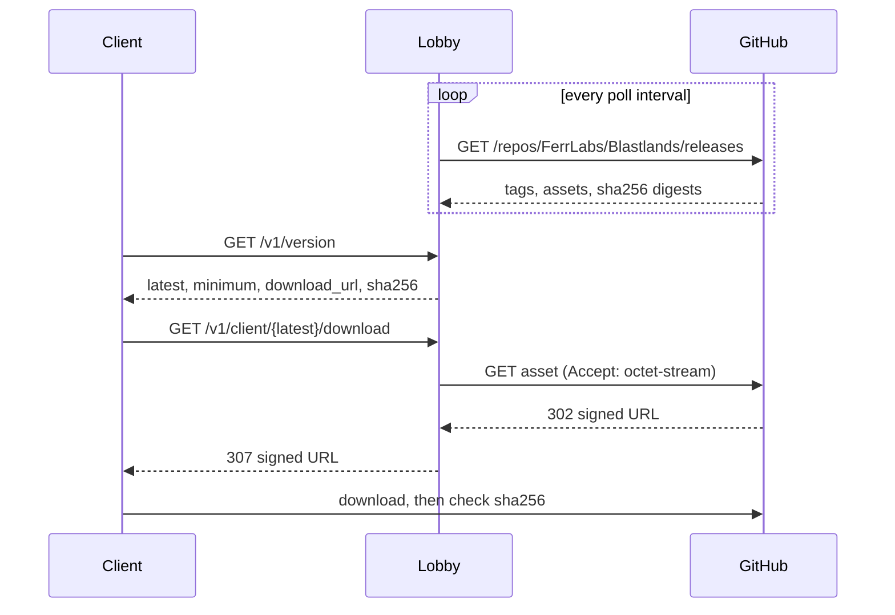
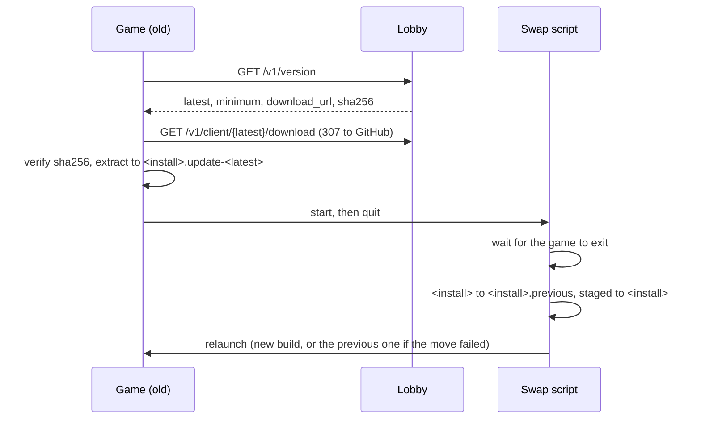

# Architecture

## Why dedicated servers

The alternative was host-client with relay (one player hosts, everyone else connects
through a relay). It was rejected:

- The host's upload bandwidth and CPU become everyone's ceiling. A bomber game is
  latency-sensitive — a bad host ruins the match for seven other people.
- The host is authoritative, so the host can trivially cheat.
- The host leaving kills the match, and host migration in a simulation-heavy game means
  re-syncing full state under time pressure.

We have a VPS, and a bomber match is cheap to simulate: an 8-player match on a 15×13 grid
at 30 Hz is a rounding error of CPU. Running the simulation server-side costs little and
removes all three problems.

## Components

### Lobby service (`server/`, Rust + axum)

Long-lived HTTP service. Owns the match directory: which matches exist, who is waiting,
and where a match's game server lives. It is deliberately dumb about gameplay — it never
sees a bomb.

Responsibilities:

- `GET /v1/matches` — public list of matches accepting players.
- `POST /v1/matches` — create a match, allocate a game server instance, return its endpoint.
- `POST /v1/matches/{id}/join` — reserve a slot, return the endpoint and a join ticket.
- Reap matches whose game server stopped heartbeating.

Match state is in-memory for now. It is intentionally not in Postgres: a match's lifetime
is minutes, nothing about it is worth surviving a restart, and a restart during a match
only costs the lobby listing — running matches keep running because clients already hold
their server endpoint. If persistence is ever needed (stats, history), that is a separate
store, not this one.

### Game server (`client/`, Unity Dedicated Server build)

The same Unity project as the client, built for the Dedicated Server platform (headless
Linux, no rendering). One process per match, one container per process.

It runs the authoritative simulation and is the only thing allowed to decide that a player
died. Clients send inputs; the server sends state. Bots are just players whose inputs come
from `BotBrain` instead of a socket — the simulation cannot tell the difference, which is
what keeps them honest.

Building the server from the same project as the client is the point: gameplay code exists
once. A separate Rust game server was considered and rejected — it would mean writing every
bomb, blast and power-up rule twice, in two languages, and keeping them bit-identical
forever.

It starts itself. `ServerBootstrap` runs on load in a server build, so there is no scene to
wire and no inspector to fill in: everything it needs comes from `--port`, `--match`,
`--players` and `--lobby`, or from `BLASTLANDS_PORT` and friends when the host is configured
once and the arguments name the instance. All four are required, an argument beats the
environment, and a bad one refuses to start rather than guessing. A wrong port collides with
a neighbour, a wrong match id releases somebody else's match.

The guard is `UNITY_SERVER`, which Unity defines for the Dedicated Server subtarget itself,
rather than a hand-added `SERVER` define somebody has to keep in step with `build.yml`.
`LocalMatchDriver` switches itself off under it, and since the view, HUD, camera and fog are
only ever built when that driver binds them, the client scene sits inert and nothing renders.

Exit codes are what a supervisor reads: 0 for a match that resolved, 1 for options it would
not start on, 2 for a match that failed to start or ran out its clock without resolving.
Anything non-zero has to mean failure, or a crash loop reads as a clean shutdown and the
match is never released.

### Client (`client/`, Unity Standalone build)

Renders, reads input, predicts local movement, reconciles against server state.

Presentation reads the simulation, never the other way round. Character animation is the
case where that is easiest to get wrong, so it is worth stating: the animator is told what
the player did last tick, and is never allowed to move anyone. Root motion is off on every
character, and the in-place clips (`Walk_Static`, `Run_Static`) are the ones selected, so a
stride cannot displace a transform the simulation owns down to the sub-tile unit. A player
who animates their way off their own position is a player the server will disagree with.

The stride rate is a ratio of the ground the simulation actually moved someone over
against the speed the clip was authored at, which is why `MatchView.runClipSpeed` exists.
Swapping animation packs means measuring that number again rather than accepting whatever
skating falls out.

## The simulation core

`client/Assets/_Game/Core/` is plain C# with **no `UnityEngine` dependency**. This is a hard
rule, enforced by the assembly definition and by the fact that `tests/` compiles the same
sources under plain .NET.

Two things fall out of it:

- CI runs the gameplay tests with `dotnet test`, in seconds, with no Unity licence and no
  10 GB editor image. Only builds and PlayMode tests need the licence.
- The simulation is deterministic and engine-independent, which is what makes
  client-side prediction and server reconciliation tractable: both sides run the same code
  on the same inputs and must agree.

Determinism rules for anything under `Core/`:

- Integer grid coordinates and fixed-point sub-tile positions. No `float`, no `Vector3`.
- No `System.Random` without an explicit seed carried in the match state.
- No wall-clock time, no `DateTime.Now`. Time is a tick counter.
- No iteration over unordered collections where order affects outcome.

## Match lifecycle

```
client                    lobby                     game server
  │                         │                            │
  ├─ POST /v1/matches ─────▶│                            │
  │                         ├─ allocate instance ───────▶│ (container starts)
  │                         │◀─ ready, host:port ────────┤
  │◀─ match + endpoint ─────┤                            │
  │                                                      │
  ├─ connect (UDP, join ticket) ────────────────────────▶│
  │◀════════ authoritative state, 30 Hz ════════════════▶│
  │                         │◀─ heartbeat / final score ─┤
  │                         │◀─ instance exits ──────────┤
```

Other clients see the match via `GET /v1/matches` between creation and start, and join the
same way.

## Updating the client

There is no launcher, so nothing else can update the game. That makes the update path part
of the architecture rather than a packaging detail.

The failure it exists to prevent is not "the player misses a feature". It is an outdated
client joining a current match: the simulation is deterministic and lockstep-ish, so a client
running different rules **desyncs silently** rather than failing loudly. Everyone's match is
quietly wrong. Refusing that client up front is the whole point.

**The lobby is the gate.** `GET /v1/version` returns:

```json
{ "latest": "26.9.0", "minimum": "26.8.0",
  "download_url": "https://api.blastlands.ferrlabs.com/v1/client/26.9.0/download", "sha256": "…" }
```

**`latest` comes from GitHub, not from configuration.** Every `BLASTLANDS_RELEASE_POLL_SECONDS`
(300 by default) the lobby lists the repository's releases with `BLASTLANDS_GITHUB_TOKEN` and
keeps the highest version, drafts and prereleases excluded, that carries
`Blastlands-v<version>-windows.zip`. `sha256` is the digest GitHub computes on that asset.
FerrFlow cuts the release before `build.yml` attaches the archive, so for the hour in between
the lobby keeps announcing the previous build rather than one nobody can download.

Until the first read succeeds, `/v1/version` answers **503** `release_unknown`, which the client
treats like an unreachable lobby.

**The repository is private**, so a player cannot fetch the asset directly.
`GET /v1/client/<version>/download` asks GitHub for the asset with the lobby's token and
answers **307** to the short-lived signed URL GitHub hands back. That link is reused for 60
seconds, well inside the roughly 40 minutes GitHub signs it for, so the API calls stay at about
one a minute however many players update at once: every call spends the same hourly quota as
the release poll, and a download per call would let a release-day crowd exhaust it. The version is in the path on
purpose: a client that read 26.9.0 and its hash gets a 404 rather than 26.9.1 if a release
lands in between, instead of a download that fails its hash check for no visible reason.



Every client sends `x-blastlands-version` on match create and join. Below `minimum` the lobby
answers **426 Upgrade Required** — a status that says "this would work on a newer build",
which is exactly the signal an updater needs. A missing or malformed header is a 400: a client
that does not identify itself is either ancient or not ours.

Two deliberate asymmetries:

- `GET /v1/version` is **ungated**. A client too old to play still has to be able to ask what
  to upgrade to, or it is stuck with no way out.
- A client **newer** than `latest` is allowed in. A developer build must not be locked out by
  its own lobby.

`minimum` moves only when the wire format or the simulation rules change, which is a decision
rather than a consequence of a build, so it stays `BLASTLANDS_CLIENT_MINIMUM` in the lobby's
configuration. A new release alone offers an update; bumping `minimum` forces one.

**Applying the update.** `ClientStartup` asks the lobby on every launch of a player build,
against `https://api.blastlands.ferrlabs.com` unless `--lobby <url>` says otherwise. Below
`minimum`, a Windows player updates itself; between `minimum` and `latest` the update is only
logged until the client has screens to offer it (#19). Other platforms never self-update: the
release publishes a Windows archive only.

On Windows a running executable cannot replace itself, so `ClientUpdater`:

1. downloads the archive to the temporary cache directory, never over the install;
2. checks it against the published SHA-256 and stops on a mismatch. Installing whatever was
   downloaded would be a remote code execution vector, so this is not optional;
3. extracts it into a sibling of the install, `<install>.update-<version>`, refusing any entry
   that is absolute or climbs out with `..`;
4. writes a PowerShell script, starts it and quits.

The script waits for the game to exit, renames the install to `<install>.previous`, renames the
staged build into its place and relaunches. If the new build cannot be moved in, the previous
one is moved back and relaunched, so a failed swap never leaves nothing to run. The previous
build is kept until the next update replaces it.



## Deployment

Single VPS to start. Both images run under Docker on the same host:

- `ghcr.io/ferrlabs/blastlands/lobby` — one container, behind TLS, public HTTP. Built and
  published by `docker.yml`.
- A game server image. Planned, not built: `docker.yml` publishes only the lobby, and
  nothing turns the Linux dedicated server artifact from `build.yml` into an image.

**The lobby allocates a port, not an instance.** This section used to say allocation starts
as "the lobby runs a container and tracks the port". It does not, and never did. What
`PortPool` hands out is a number from `BLASTLANDS_PORT_RANGE`, which the lobby returns to
the client as `BLASTLANDS_GAME_SERVER_HOST:port` and then assumes something is already
listening on. The crate has no process spawning and no container client at all: its whole
dependency list is axum, serde, thiserror, tokio, tower-http, tracing and uuid, and the only
`spawn` in it is the tokio task that reaps silent matches.

So the seam is not "the allocation seam is the only thing that changes". The seam does not
exist yet, on either side of the port. What does exist is everything either side of it: the
lobby hands out the number and waits, and an instance started on that number reports in and
releases when it is done. Starting one is the missing piece, and #169 holds the decision
between a warm pool of instances on fixed ports, the lobby learning to create Kubernetes
Jobs, and Agones.

Worth keeping in mind whichever way that goes: the client already treats the game server
endpoint as opaque, so it is the only part of this that needs no changes.

Nothing here touches `FerrLabs-Cloud/api` or the `Kit` crates. Like FerrGames, Blastlands is
standalone: its own service, its own state, no shared back-office, no accounts. It is a
FerrLabs project at the brand level.
